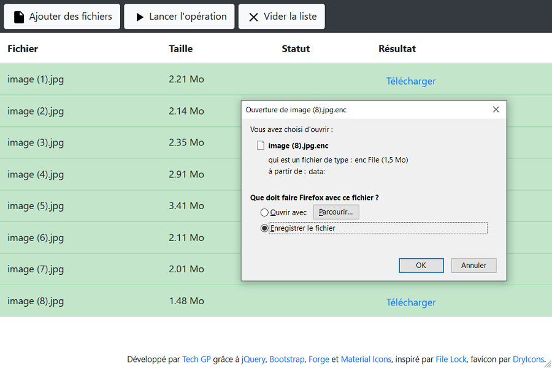

# webapps-cipher

File encryption using AES 256 bits in GCM mode

## Présentation

[Cette application](https://techgp.fr:9005/webapps-cipher/webapps-cipher.html) écrite en HTML5, JavaScript et CSS3 vous permettra de chiffrer/déchiffrer des fichiers sensibles sans avoir besoin d'installer un programme. Tout se passe dans le navigateur.

L'application utilise les algorithmes suivants :

- [PBKDF2](https://fr.wikipedia.org/wiki/PBKDF2), [HMAC](https://fr.wikipedia.org/wiki/Keyed-Hash_Message_Authentication_Code) et [SHA-256](https://fr.wikipedia.org/wiki/SHA-2#SHA-256) pour générer la clef à partir de la phrase de passe
- [AES 256 bits](https://fr.wikipedia.org/wiki/Advanced_Encryption_Standard) avec une clef de 256 bits, en mode [GCM](https://fr.wikipedia.org/wiki/Galois/Counter_Mode) pour le chiffrement

Les librairies suivantes ont été utilisées pour cette application :

- [Forge 0.9.1](https://github.com/digitalbazaar/forge)
- [jQuery 3.4.1](https://jquery.com/)
- [Bootstrap 4.4.1](https://getbootstrap.com/)
- [Popper 1.16.1](https://popper.js.org/), dépendance de Bootstrap 4
- [Material Icons](https://material.io/tools/icons) pour les boutons
- [DryIcons](https://dryicons.com/) pour le favicon

## Compilation de Forge

La version de `Forge` utilisée a été recompilée manuellement pour n'inclure que ce qui nous intéresse (PBKDF2, SHA-1, SHA-256 et random)

- récupérer le repository

```bash
git clone --depth 1 --branch 0.9.1 https://github.com/digitalbazaar/forge.git
cd forge
```

- ajouter une cible webpack personnalisée dans `webpack.config.js` :

```javascript
const outputs = [

  {
    entry: ['./lib/pbkdf2.js', './lib/sha1.js', './lib/sha256.js', './lib/random.js', './lib/forge.js'],
    filenameBase: 'forge-custom-cipher',
    libraryTarget: 'umd'
  }

];
```

- construire Forge

```bash
npm install
npm run build
```

Le résultat se trouve dans le dossier `dist`

## Captures d'écran

### Présentation de l'IHM


### Saisie de la phrase de passe


### Affichage de la progression


### Récupération du résultat



### IHM adaptée aux petits écrans


## Licence

Ce projet est distribué sous licence MIT, reproduite dans le fichier LICENSE ici présent.

## Changelog

- 2016-03-07 : première version
- 2016-03-18 : ajout du favicon
- 2016-06-28 : ajout du fichier LICENCE
- 2016-07-16 : mise à jour de jQuery (2.1.4 => 2.2.4)
- 2017-05-21 : mise à jour de jQuery (2.2.4 => 3.2.1), Bootstrap (3.3.6 => 3.3.7), Bootstrap Switch (3.3.2 => 3.3.4) et Forge (0.6.39 => 0.6.49)
- 2018-08-25 : modification du message en cas de mot de passe incorrect au déchiffrement
- 2018-08-25 : mise à jour de jQuery (3.2.1 => 3.3.1) et Forge (0.6.49 => 0.7.6) et renommage de "bootstrap" en "bootstrap3"
- 2018-08-25 : passage des liens en HTTPS
- 2020-04-08 : migration vers un Service Worker au lieu de Application Cache
- 2020-04-08 : migration vers Bootstrap 4 (4.4.1), intégration de Popper (1.16.1), mise à jour de jQuery (3.4.1)
- 2020-04-08 : mise à jour et optimisation de Forge (0.9.1) en créant une cible webpack personnalisée 
- 2020-04-08 : suppression des dépendances vers Bootstrap Switch et Glyphicons, remplacée par des svg de Material Icons
- 2020-04-08 : correction du téléchargement de fichiers déchiffrés, qui ajoutait une extension ".txt" non souhaitée