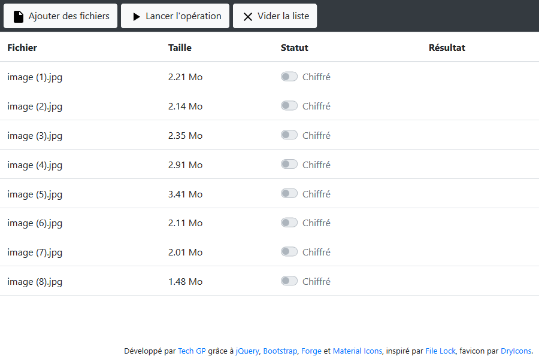
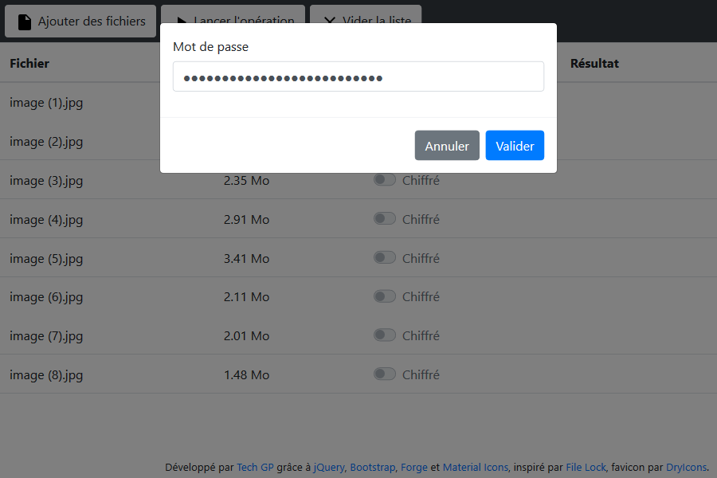

# webapps-cipher

File encryption using AES 256 bits in GCM mode

## Présentation

[Cette application](http://techgp.fr/webapps/webapps-cipher.html) écrite en HTML5, JavaScript et CSS3 vous permettra de chiffrer/déchiffrer des fichiers sensibles sans avoir besoin d'installer un programme. Tout se passe dans le navigateur.

L'application utilise les algorithmes suivants :

- [PBKDF2](https://fr.wikipedia.org/wiki/PBKDF2), [HMAC](https://fr.wikipedia.org/wiki/Keyed-Hash_Message_Authentication_Code) et [SHA-1](https://fr.wikipedia.org/wiki/SHA-1) pour générer la clef à partir de la phrase de passe
- [AES 256 bits](https://fr.wikipedia.org/wiki/Advanced_Encryption_Standard) avec une clef de 256 bits, en mode [GCM](https://fr.wikipedia.org/wiki/Galois/Counter_Mode) pour le chiffrement

Les librairies suivantes ont été utilisées pour cette application :

- [jQuery 2.1.4](http://jquery.com/)
- [Bootstrap 3.3.6](http://getbootstrap.com/css/)
- [Forge 0.6.39](https://github.com/digitalbazaar/forge)
- [Bootstrap Switch 3.3.2](https://github.com/nostalgiaz/bootstrap-switch)

L'application est fournie avec un fichier manifest `webapps-cipher.appcache` permettant la mise en cache et l'utilisation en mode déconnecté. Plus d'info chez Mozilla [en français](https://developer.mozilla.org/fr/docs/Utiliser_Application_Cache) ou [en anglais](https://developer.mozilla.org/en-US/docs/Web/HTML/Using_the_application_cache).

NB : quand le certificat HTTPS est incorrect, la mise en cache échouera sous Chrome avec l'erreur `Manifest fetch Failed (9)`. Dans ce cas, faites les tests en HTTP et/ou utilisez un certificat valide en production.

## Captures d'écran

### Présentation de l'IHM



### Récupération des fichiers chiffrés / déchiffrés



### Interface responsive et barre de progression


## Intégration à Play

Pour intégrer à [Play](https://www.playframework.com/), il faut :

1. Déposer les 4 fichiers dans le dossier `public`

    - webapps-cipher.appcache
    - webapps-cipher.css
    - webapps-cipher.html
    - webapps-cipher.js

2. Pour que la mise en cache se fasse, le type mime `text/cache-manifest` doit être renvoyé pour le fichier `appcache`. On ajoute donc une règle au fichier `routes`

    ```
    GET		/assets/webapps-cipher.appcache		controllers.Application.manifest(path: String = "webapps-cipher.appcache")
    ```

3. L'implémentation ressemble à ça :

    ```java
    public class Application extends Controller {

    	public final Result manifest(String path) {
    		return ok(Play.current().getFile("public/" + path)).as("text/cache-manifest");
    	}

    }
    ```
